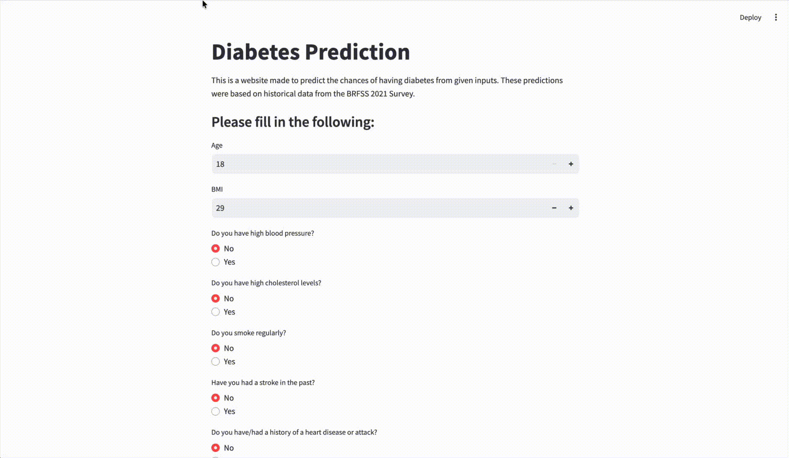
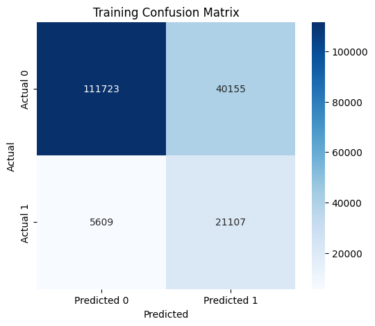
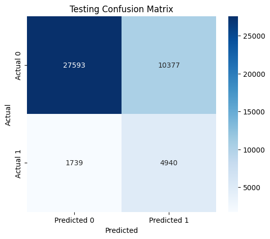

# Diabetes Risk Prediction

## Overview

This project develops a machine learning model to estimate an individual's likelihood of having diabetes based on health and lifestyle information.

The model was trained using historical health survey data from the **Behavioral Risk Factor Surveillance System (BRFSS) 2021 Survey**. Users can input personal health information through an interactive Streamlit web application to receive an estimated diabetes probability and corresponding risk category.

> Note: This application is designed for educational purposes and should not be considered a medical diagnosis or a replacement for professional healthcare advice.

---

## Application Demo

The Streamlit application allows users to enter health-related information, including:

- Age
- BMI
- Blood pressure history
- Cholesterol levels
- Smoking status
- Physical activity
- General health indicators
- Mental and physical health indicators

The model then provides:
- Estimated diabetes probability
- Risk category interpretation


<p align="center">
  
</p>


---

## Model Performance

The final model was evaluated on both the training and testing datasets to assess model performance and generalisation ability.

### Training Classification Report

| Class | Precision | Recall | F1-score | Support |
|------|-----------|--------|----------|---------|
| 0.0 | 0.95 | 0.74 | 0.83 | 151,878 |
| 1.0 | 0.34 | 0.79 | 0.48 | 26,716 |
| **Accuracy** | | | **0.74** | **178,594** |
| **Macro Avg** | 0.65 | 0.76 | 0.65 | 178,594 |
| **Weighted Avg** | 0.86 | 0.74 | 0.78 | 178,594 |




### Testing Classification Report

| Class | Precision | Recall | F1-score | Support |
|------|-----------|--------|----------|---------|
| 0.0 | 0.94 | 0.73 | 0.82 | 37,970 |
| 1.0 | 0.32 | 0.74 | 0.45 | 6,679 |
| **Accuracy** | | | **0.73** | **44,649** |
| **Macro Avg** | 0.63 | 0.73 | 0.63 | 44,649 |
| **Weighted Avg** | 0.85 | 0.73 | 0.76 | 44,649 |




### Performance Summary

The model achieved a similar performance between the training and testing datasets, with accuracy of **74%** on training data and **73%** on unseen testing data.

The model demonstrated strong recall for the positive diabetes class, achieving **79% recall during training** and **74% recall during testing**. This indicates that the model is effective at identifying potential diabetes cases.

The small difference between training and testing performance suggests that the model generalises well and does not show significant signs of overfitting. However, the lower precision for the positive class (**34% training, 32% testing**) indicates that some individuals predicted as having diabetes may be false positives.

## Diabetes Risk Interpretation

The predicted probability is converted into a risk category:

| Probability Range | Risk Category | Interpretation |
|------------------|---------------|----------------|
| ≥ 80% | Extremely High Risk | Very high estimated likelihood. Consider consulting a healthcare professional. |
| 70% - 79% | High Risk | High estimated likelihood. Consider monitoring health indicators and seeking professional advice. |
| 60% - 69% | Moderate Risk | Increased estimated likelihood. Consider preventive health measures. |
| 40% - 59% | Unlikely | Lower estimated likelihood, but maintaining healthy habits is recommended. |
| 20% - 39% | Very Unlikely | Low estimated likelihood based on provided information. |
| < 20% | Extremely Unlikely | Very low estimated likelihood based on provided information. |

---

## Dataset

The model was trained using the **Behavioral Risk Factor Surveillance System (BRFSS) 2021 Survey**, a large-scale health survey containing information on health behaviours, chronic conditions, and preventative health practices.

Key features used include:

- Demographic information
- Health conditions
- Lifestyle factors
- Physical and mental health indicators

---

## Technologies Used

- Python
- Scikit-learn
- Pandas
- NumPy
- Matplotlib
- Joblib
- Streamlit


## Repository Structure

```text
.
├── app/
│   └── app.py                         # Streamlit web application
│
├── model/
│   └── model.py                       # Saved trained model
│
├── results/
│   ├── train_result.png               # Training classification report
│   ├── test_result.png                # Testing classification report
│   └── diabetes_prediction_demo.gif   # Gif of diabetes prediction website demonstration  
│
├── pred-model.ipynb                   # Data preprocessing, EDA, and model development
├── requirements.txt                   # Python dependencies
├── README.md                          # Project documentation
└── .gitignore                         # Files excluded from Git tracking
```
---

## How to Run the Application

1. Clone the repository:

```bash
git clone <repository-url>
```

2. Install dependencies:

```bash
pip install -r requirements.txt
```

3. Run the Streamlit application:

```bash
streamlit run app/app.py
```

4. Enter health information and click **Calculate** to generate a diabetes risk estimate.